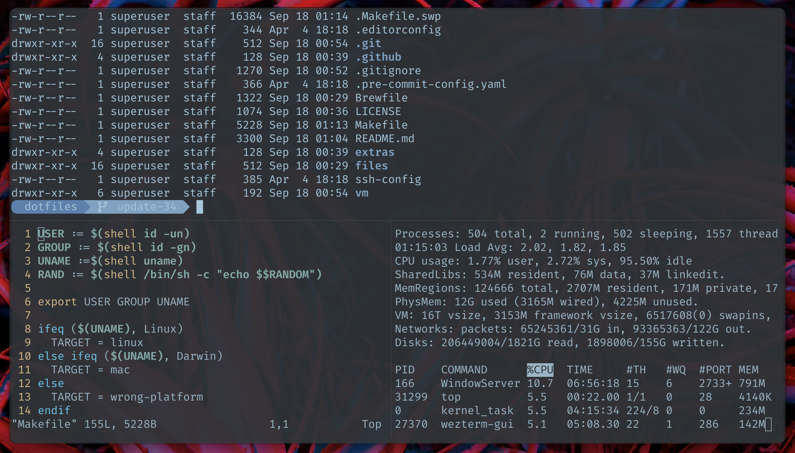

```
██████╗  ██████╗ ████████╗███████╗██╗██╗     ███████╗███████╗
██╔══██╗██╔═══██╗╚══██╔══╝██╔════╝██║██║     ██╔════╝██╔════╝
██║  ██║██║   ██║   ██║   █████╗  ██║██║     █████╗  ███████╗
██║  ██║██║   ██║   ██║   ██╔══╝  ██║██║     ██╔══╝  ╚════██║
██████╔╝╚██████╔╝   ██║   ██║     ██║███████╗███████╗███████║
╚═════╝  ╚═════╝    ╚═╝   ╚═╝     ╚═╝╚══════╝╚══════╝╚══════╝
```

[](https://github.com/exdial/dotfiles/actions/workflows/pre-commit.yml)

# Abstract

This repository serves as a storage for all environment settings (dotfiles).

Built-in Makefile provides automated installation of dotfiles and packages.

Only Mac 🍏 and Linux 🐧 are supported platforms.



Built-in Makefile will help you manage **Bash**, **Git** and **Vim** settings,
**.dircolors**, **.editorconfig**, **.inputrc**, etc...

## Usage

Open Terminal program on this repository and run `make`.
You will see the options available to you.

```
all            Install dotfiles, packages and extra
install        Install dotfiles only (.bashrc, .gitconfig, .ssh/config, etc...)
clean          Remove backup files created during installation (.dotfiles_save_)
secrets        Make an archive with ssh keys, aws tokens, etc
bootstrap      Bootstrap a brand new Linux VM
```

Run `make all` to copy configuration files, install homebrew and set up
the git client on your system. At the end of the installation, you will be asked to
provide an email address and name to complete the *.gitconfig* setup.

The `make install` command install only dotfiles.

The installation process will create backup copies of existing dotfiles, if any.
You can find them named *dotfiles_save_* in your home directory.

The `make clean` command will remove these backup directories from your computer.

## Secrets

The sensitive directories `~/.aws`, `~/.grip`, `~/.hal`, `~/.kube`, `~/.spin`, `~/.ssh`
will not be overwritten or deleted by the automatic installation.
The `make secrets` will copy these directories and create
an archive in the current directory named *secrets.tar.gz*,
which can be easily saved to a new location.

## Feedback

[Suggestions and improvements](https://github.com/exdial/dotfiles/issues).
