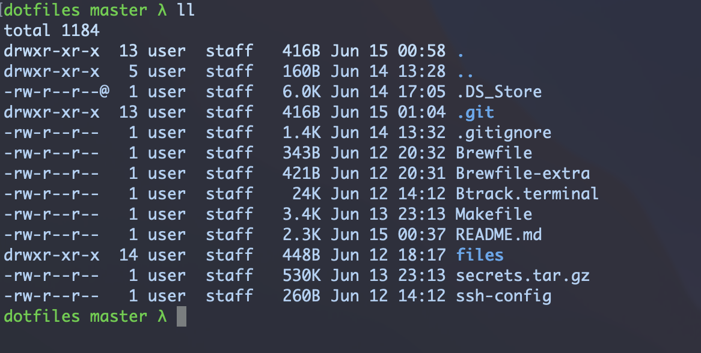

```
            _       _    __ _ _
           | |     | |  / _(_) |
         __| | ___ | |_| |_ _| | ___  ___
        / _` |/ _ \| __|  _| | |/ _ \/ __|
       | (_| | (_) | |_| | | | |  __/\__ \
        \__,_|\___/ \__|_| |_|_|\___||___/
```

[](https://github.com/repconn/dotfiles/actions/workflows/pre-commit.yml)

# Abstract

This repository serves as a central storage for all environment settings (dotfiles).
Built-in Makefile provides automated installation of environment settings
and recommended software.

Only Mac 🍏 and Linux 🐧 are supported platforms.



## Usage

Built-in Makefile will help you to manage **Bash**, **Git** and **Vim** settings,
**.dircolors**, **.editorconfig**, **.inputrc** and so on.

This will never change or delete [sensetive directories](#secrets-management),
which usually contain important tokens or keys.

Open Terminal program on this repository and run `make`.
You will see the options available to you.

```
all            Install all dotfiles, packages and extra
clean          Remove backup configs
install        Install dotfiles
secrets        Make an archive with ssh keys, aws tokens, etc
uninstall      Remove dotfiles including ssh config
```

Run `make all` to install preconfigured dotfiles and the list of recommended software
on your system. Please note it is potentially dangerous operation that can delete
all your previous settings. In the end of installation, you will be asking for
email and name to complete configuration of *.gitconfig*.

Installation process will backup existing dotfiles if any.
You can find them by name *dotfiles_save_* in your home directory.
`make clean` command will delete these backup directories from your computer.

You can run `make install` instead of `make all` to install the only dotfiles
without performing installation heavy packages, like browsers, etc.

Among other things you can find the option of dotfiles uninstallation quite useful.
Run `make uninstall` to remove all dotfiles including the SSH configuration file.

## Secrets management

These sensetive directories will not be overwritten or deleted during
dotfiles management: `~/.aws`, `~/.grip`, `~/.hal`, `~/.kube`, `~/.spin`, `~/.ssh`.
The option `make secrets` will copy these directories and create
an archive in the current directory nameed *secrets.tar.gz*,
that can be easily transferred to a new location.
